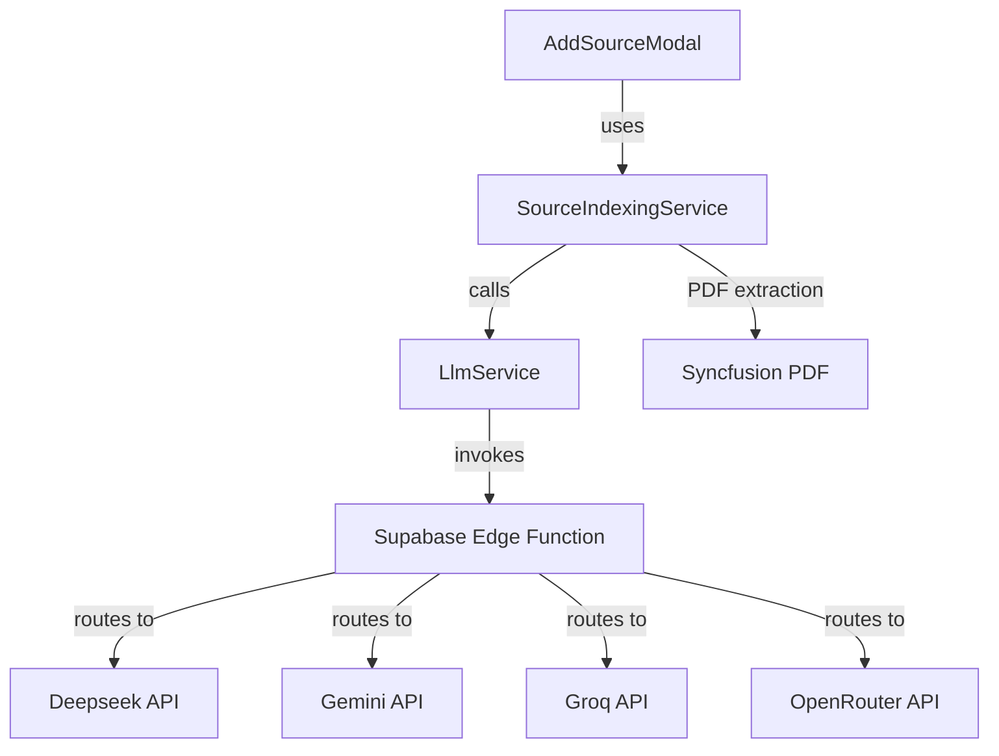

# Source Indexing with LLM Integration - Implementation Walkthrough

**Date:** 2026-01-19

## Summary

Implemented source content indexing with LLM integration via Supabase Edge Functions, supporting multiple AI providers (Deepseek, OpenRouter, Gemini, Groq).

---

## Changes Made

### New Files Created

| File | Purpose |
|------|---------|
| `supabase/functions/llm-chat/index.ts` | Universal Edge Function for multi-provider LLM |
| `lib/core/services/llm_service.dart` | Abstract LLM service interface |
| `lib/core/services/supabase_llm_service.dart` | Supabase Edge Function implementation |
| `lib/core/models/llm_models.dart` | LLM request/response models |
| `lib/core/data/config/supabase_config.dart` | Supabase connection configuration |

### Modified Files

| File | Changes |
|------|---------|
| `lib/core/models/index_item.dart` | Redesigned with short IDs (`idx_xxxxxxxx`) and type-specific properties |
| `lib/core/services/source_indexing_service.dart` | Full implementation with PDF extraction, LLM integration, progress callbacks |
| `lib/main.dart` | Added Supabase initialization |
| `lib/core/data/providers/datasource_providers.dart` | Added `llmServiceProvider` and `sourceIndexingServiceProvider` |
| `lib/features/sources/components/add_source_modal.dart` | Converted to ConsumerStatefulWidget with indexing progress display |
| `pubspec.yaml` | Added `syncfusion_flutter_pdf` dependency |

---

## Architecture

---

## Key Features

### Multi-Provider LLM Function
- Single Edge Function supporting 4 providers
- Uses official SDKs for each provider
- Token usage tracking for credit deduction (TODO marker in place)
- CORS-enabled for browser requests

### IndexItem Redesign
- Short unique IDs: `idx_a1b2c3d4` format
- Type-specific properties:
  - Text: `paragraphNumber`
  - PDF: `pageNumber`
  - Audio/Video: `startTimestamp`, `endTimestamp`
  - Image: `imagePath`

### PDF Indexing
- Text extraction using Syncfusion Flutter PDF
- Splits content into paragraphs
- Preserves page number metadata

### Progress Tracking
- Real-time status updates during indexing
- Displayed in upload area of AddSourceModal

---

## Next Steps

1. **Deploy Edge Function**: Deploy `llm-chat` to Supabase with API keys configured
2. **Set Environment Variables**:
   - `DEEPSEEK_API_KEY`
   - `GEMINI_API_KEY`
   - `GROQ_API_KEY`
   - `OPENROUTER_API_KEY`
3. **Implement Credit Deduction**: Complete the TODO in the Edge Function
4. **Add Audio Transcription**: Integrate Groq Whisper API for audio/video
5. **Sources Page Status**: Add indexed/pending badges to source cards

---

## Verification

✅ Flutter analyze: Only pre-existing warnings (deprecated `withOpacity`)  
✅ Dependencies installed successfully  
✅ Code compiles without errors
