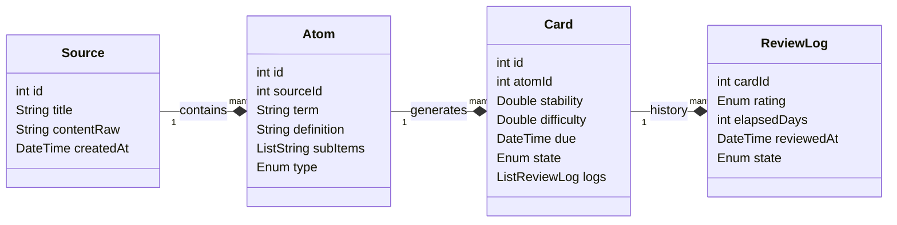
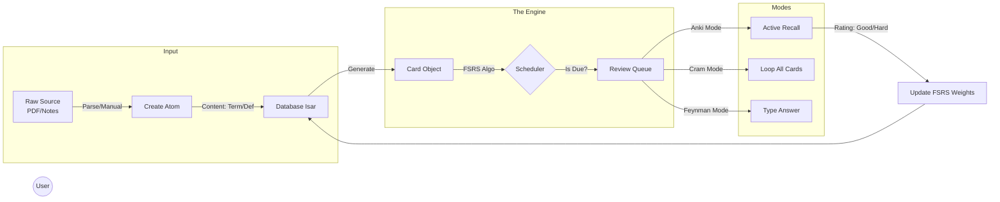

# Project 2359: Architecture & Development Overview

This document outlines the "Universal Atom" architecture, data models, and development phases for Project 2359.

## Core Architecture: The Universal Atom

This architecture separates **Content** (what is it?) from **State** (do I know it?). This separation is crucial to support both Anki-style users (state-heavy) and Passive readers (content-heavy) simultaneously.

### Why Isar (NoSQL)?

Given the requirement for high performance with flexible sub-items in Dart/Flutter, **Isar** is the chosen database.

1.  **Dart Native:** Deals with Dart Objects directly, avoiding messy join tables for things like `List<String>` or `List<SubItem>`.
2.  **Speed:** Strictly faster than SQLite for read-heavy operations (scanning thousands of cards).
3.  **Offline-First:** Built for "local-first, sync later".

---

## Data Model Design

We define three distinct layers:

1.  **The Source:** Origin of the information (Lecture, PDF, Note).
2.  **The Atom (Base Class):** The actual information (Term, Definition, Subitems).
3.  **The Card (The Test):** The FSRS data attached to an Atom.



---

## Implementation Guide (Dart/Isar)

### 1. The Content Layer (`Atom`)

Holds `term`, `definition`, and `subitems`. One "Concept" might spawn multiple tests (Flashcard, Feynman Mode, Passive Read).

```dart
@collection
class Atom {
  Id id = Isar.autoIncrement;

  @Index()
  late int sourceId; // Links back to "Biology Chapter 1"

  late String mainContent; // "The Term" or Question
  late String secondaryContent; // "The Definition" or Answer

  List<String>? subItems; // Flexible list for "Context" or extra bullets

  @Enumerated(EnumType.ordinal)
  late AtomType type; // FLASHCARD, FEYNMAN, MULTI_CHOICE
}

enum AtomType { flashcard, feynman, mcq }
```

### 2. The Engine Layer (`Card`)

This object *only* cares about scheduling (FSRS).

```dart
@collection
class Card {
  Id id = Isar.autoIncrement;

  @Index()
  late int atomId; // The thing being tested

  // FSRS Data (The "Anki" brain)
  double stability = 0.0;
  double difficulty = 0.0;
  DateTime due = DateTime.now();
  
  @Enumerated(EnumType.ordinal)
  CardState state = CardState.newCard; // New, Learning, Review, Relearning

  int reps = 0;
  int lapses = 0;
}
```

---

## Development Roadmap

### Phase 1: The "Crammer" MVP (Day 1-3)
**Focus:** Data Entry & "Dumb" Review.
*   **Goal:** User can create a deck, add atoms, and view them.
*   **Actions:**
    1.  Set up Isar with `Atom` and `Source`.
    2.  Build the **Input UI**: Simple form with "Term", "Definition", and "+ Add Subitem".
    3.  Build the **Crammer View**: A swiper that loops through `Atoms` ignoring FSRS.

### Phase 2: The "Anki Power" Upgrade (Day 4-7)
**Focus:** FSRS Integration.
*   **Goal:** Integrate `fsrs` package and enable "Smart Scheduling."
*   **Actions:**
    1.  Create the `Card` entity linked to `Atoms`.
    2.  Implement the scheduler: Update `Card.stability` and `Card.due` on rating.
    3.  Build the **Dashboard**: Show "Due Today: 15".

### Phase 3: The "Context" & "Feynman" Layer (Week 2)
**Focus:** Sophisticated Users.
*   **Goal:** Link cards back to source material and enable open-ended study.
*   **Actions:**
    1.  **Source Linking:** "Show Context" button querying `Source` object.
    2.  **Feynman Mode:** "Session Mode" with text box input instead of reveal.

---

## App Flow Visualization



## Next Steps
Initialize the Isar project and create the `Atom` class. Focus on saving a "Term" with "Subitems" first.
